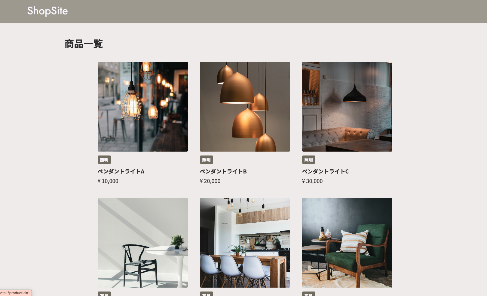
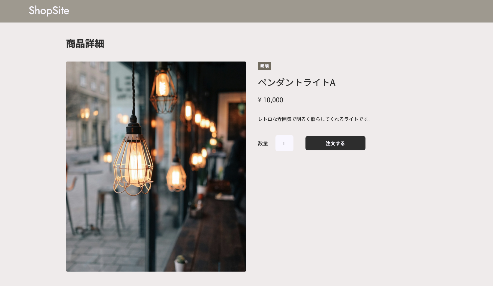
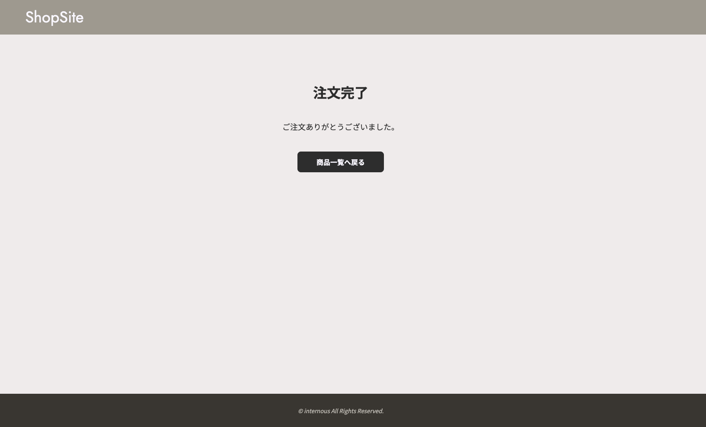

# ECサイト制作（Springboot）

研修課題として制作した、商品一覧画面と商品詳細画面が閲覧できるECサイトアプリケーションです。

## 実行画面

### 商品一覧画面


### 商品詳細画面


### 注文完了画面



## 主な機能
**商品一覧表示**: データベースから取得した商品の一覧表示 <br>
**商品詳細表示**: IDに紐づく商品の詳細情報の動的表示

## 制作で意識したポイント
**データベースとの連携（DAOの実装）**:
MySQLから商品情報を取得するために、SQLの発行や接続処理を行うプログラム（DAO）を作成しました。

**データの整理と受け渡し（DTOの活用）**:
データベースから取り出した情報を、画面で使いやすい形にまとめて受け渡す仕組み（DTO）を学び、実装に取り入れました。

**開発環境の構築と管理**:
MAMPによるデータベース構築やEclipseの設定など、Webアプリを動かすための土台作りを経験しました。

## 使用技術
- **Language**: Java(Springboot) / HTML5 / CSS3
- **Database**: MySQL
- **Environment**: MAMP (Apache)
- **Tool**: Eclipse / Git

## ディレクトリ構造詳細

<details>
<summary>詳細なディレクトリ構造</summary>

```text
src/main/java/jp/co/internous/ecsite
├── controller
│   ├── OrderHistoryController.java  # 注文履歴・完了処理の制御
│   └── ProductController.java       # 商品一覧・詳細画面の遷移制御
├── dao
│   ├── OrderHistoryDao.java         # 注文情報に関するDBアクセス
│   └── ProductDao.java              # 商品情報に関するDBアクセス
├── dto
│   └── ProductDto.java              # 画面表示用のデータ転送オブジェクト
└── SbEcsiteApplication.java          # アプリケーションの起動クラス

src/main/resources
├── templates                        # 画面（HTML）ファイル
│   ├── product_list.html            # 商品一覧画面
│   ├── detail.html                  # 商品詳細画面
│   └── complete.html                # 注文完了画面
└── static/css                       # スタイルシート
    ├── product_list.css
    ├── detail.css
    └── complete.css
>>>>>>> 689d637 (READMEの追加)
